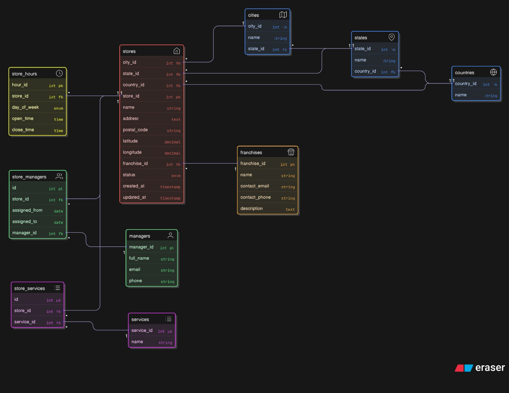

<h1 align="center">📍 Franchise Store Locator & Manager Tool</h1>
<h3 align="center">A scalable SQL-based system to manage, locate, and analyze franchise store data with support for geospatial queries, service tracking, and advanced reporting.</h3>

  
  
  
  

---

<h3>📘 Overview</h3>

This project provides a fully normalized SQL schema designed for managing franchise store data with a geographic hierarchy, service availability, and staff assignments. It supports reporting, querying, and geospatial features like proximity search via the Haversine formula.

---

<h3>🧱 Schema Design Summary</h3>

  

- **`countries`, `states`, `cities`**  
  - Hierarchical structure for reusability and normalization.
  - Linked using foreign keys.

- **`franchises`**  
  - Stores metadata of each franchise (contact info, description).
  - One-to-many relationship with stores.

- **`stores`**  
  - Main table for all store locations.
  - Linked to city, state, country, and franchise.
  - Includes coordinates, postal code, and operational status.

- **`managers`, `store_managers`**  
  - Many-to-many relationship with historical tracking (start/end dates).

- **`store_hours`**  
  - Tracks store hours for each day of the week using ENUM.

- **`services`, `store_services`**  
  - Many-to-many mapping for services like delivery, dine-in, pickup.

- **Indexes & Constraints**  
  - Foreign keys, ENUMs, indexing, and timestamp tracking (`created_at`, `updated_at`).

---

<h3>🚀 Bonus Features</h3>

- 📍 **Proximity search** using the Haversine formula (latitude & longitude).
- 🧑‍💼 **Multi-store manager assignments** with tracked duration.
- ⏱️ Timestamp fields for creation and update tracking.
- 📊 Ready-to-use for advanced reporting & spatial querying.

---

<h3>🛠️ How to Use</h3>

1. Import `franchise_store_locator.sql` into your MySQL 8.0+ database.
2. Run the schema to create tables.
3. Insert sample data (10+ entries per table) using provided `INSERT` statements.
4. Use the provided queries for search and analytical reports.

---

<h3>✅ Evaluation Criteria Met</h3>

- ✔️ **Normalized Schema** (3NF, modular, scalable)  
- ✔️ **Efficient Queries** (optimized, clean SQL)  
- ✔️ **Data Integrity** (foreign keys, constraints, ENUMs, indexing)  
- ✔️ **Sample Data** (10+ realistic rows per table)  
- ✔️ **Documentation** (inline SQL comments & this README)  
- ✔️ **Extras** (Haversine search, timestamps, multi-store manager support)

---

<h3>🧰 Tools & Technologies Used</h3>

---

⭐ If you found this project useful, give it a star!

